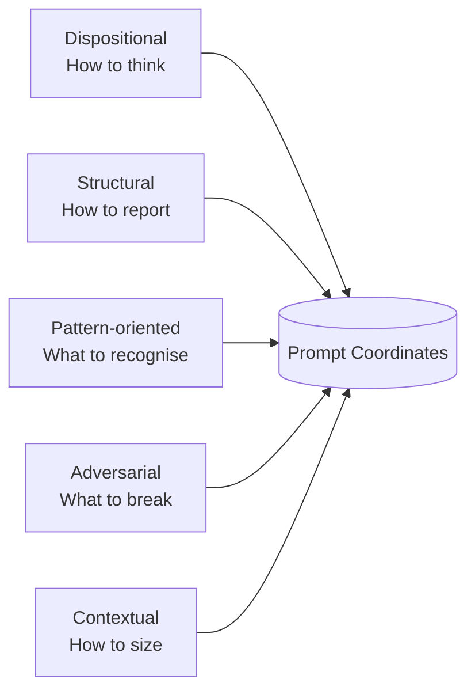

# Axis Engineering

> Created by **Steven Loftus** (2026) — Licensed under [CC BY 4.0](LICENSE)

**Axis Engineering is the practice of refusing the first plausible answer until the alternatives have been seen.** It is a prompt methodology that changes *how* AI thinks, not just *what* it outputs.

It does this by applying a small number of named "behavior handles" (e.g. Genba, Pre-mortem, MECE) that act as high-density tokens, activating existing reasoning patterns inside the model's training data. You are not teaching the AI — you are selecting which latent capabilities to emphasise. The protocols (Triangle, Prism, Two-Pass) and the cross-cutting Seesaw diagnostic are different ways of doing the one core thing: refusing premature commitment until the solution space has been surfaced.

## Protocol selector — which protocol fits this task?

```
Starting a new project — first-draft model from raw customer materials?
  → Prism Protocol (multi-lens refraction; substrate as data)
Have an agreed model — choosing between viable architectures with real tradeoffs?
  → Triangle Protocol (TQ/TC/CQ multi-agent + synthesis)
Reviewing an existing artefact for issues?
  → Two-Pass Strategy (constructive then adversarial in fresh contexts)
Routine work (config change, small feature)?
  → Single-pass with 2–3 handles

Seesaw Principle fires inside any of the above when a 3-pole tension
(Test↔Design↔Implementation, Actor↔Model↔Framework, User↔Design↔UI)
surfaces an imbalance — log a ticket, fix upstream, don't paper over.
```

See protocol docs for full mechanics: [Triangle](triangle-protocol.md) · [Prism](prism-protocol.md) · [Two-Pass](two-pass-strategy.md) · [Seesaw](seesaw-principle.md).

## The Full Vocabulary
Axis Engineering is a vocabulary of 33 terms — drawn from Toyota, McKinsey, Netflix, the Gang of Four, and other well-known frameworks — that activate deep knowledge the AI already has. Each term is a **behavior handle**: a single word or phrase that shifts how the AI approaches a task, what it looks for, and how it reports findings.

### Before and After

**Without Axis** — you ask for a code review:

```
Review this service class for issues.
```

> "The code generally follows good practices. Consider adding null checks. Method names could be more descriptive. Test coverage looks reasonable."

**With Axis** — you name three handles:

```
Approach with Genba and Chaos Engineering. Before approving, run a Pre-mortem.
```

> Reads the actual sharing keyword and finds `without sharing` on a class exposed to community users via `@AuraEnabled`. Injects a null API response and traces it to an unguarded `.get(0)` at line 47 that throws `IndexOutOfBoundsException`. Runs a pre-mortem: "This failed in production because the retry logic has no backoff — a 5-minute API outage exhausted the governor limit within 90 seconds."

The AI didn't learn anything new. **Genba** activated verification-at-source behavior. **Chaos Engineering** activated failure injection. **Pre-mortem** activated backward-from-failure reasoning. These patterns already exist in the model — you just named them.

### Five Independent Axes

Each handle belongs to one of five independent dimensions of AI behavior:

| Axis | Question | You're shaping... | Example handles |
|------|----------|-------------------|-----------------|
| **Dispositional** | How should it think? | The agent's mindset | Genba, Shoshin, First Principles |
| **Structural** | How should it report? | The output format | MECE, Pyramid Principle, Five Whys |
| **Pattern-oriented** | What should it recognise? | The pattern library | SOLID, Fowler's Catalog, DDD |
| **Adversarial** | What should it try to break? | The failure-finding instinct | Chaos Engineering, Pre-mortem, STRIDE |
| **Contextual** | How big is this problem? | The calibration | Cynefin, YAGNI, Poka-yoke |

**Rule of thumb:** Pick 2–3 handles across different axes (e.g. 1 dispositional + 1 pattern + 1 adversarial) to prevent overthinking.



Most prompts only shape axis 2 ("give me a bulleted list"). Axis Engineering deliberately engages all five. Pick 2-3 handles from different axes and the AI's analysis changes in depth, focus, and structure — from a single prompt line.

### Advanced: Multi-Agent Protocols

Three multi-agent extensions exist for problems that single-pass-with-handles can't fully resolve. Each addresses a different phase of the engineering lifecycle:

```
Customer materials → [Prism] → Agreed model → [Triangle] → Architecture → Build → [Two-Pass] → Reviewed artefact
                                                                                                ↑
                                                                Seesaw fires inside any of these ─┘
```

#### Prism Protocol — multi-lens refraction (start here for new projects)

**Use this when:**
- A new project starts with raw customer materials (SOW, transcripts, samples)
- You need a first-draft system shape the team can sign off on
- The model itself isn't yet stable; alternative shapes haven't been seen

For projects where the system shape isn't yet stable, Prism refracts each requirement through three lens-sets and surfaces the solution space rather than committing to one point. Substrate (what the platform CAN do) and industry (the actor lens-set, vocabulary, pipeline shape) are first-class config inputs — the protocol generalises across stacks without code branches.

The **three lens-sets**:
- **Actor lenses** (industry-specific) — who sees this requirement? (e.g. Underwriter, Producer/Broker, Carrier, Regulator, Finance, Operations, Compliance for `insurance.mga`)
- **Implementation lenses** (substrate-aware) — substrate stdlib (try first), overlay patterns (try second), customer extension (only if the first two don't fit)
- **Lifecycle lenses** (always three) — Day-1 launch, Year-3 maintenance, Year-5 schema-shift

A multi-agent run (Phase 1b) refracts in parallel under context isolation; a synthesis pass produces convergence (high-confidence model claims), divergence (architectural choices the human gate must resolve), unique catches (real signal — three-way subdivided into complementary coverage / hidden divergence / fluke). Phase 2 produces four artefacts: model fragment, seesaw log, open questions, and a mermaid diagram for stakeholder sign-off.

**Example output:**
> *Input: Discovery materials for an MGA implementation across four insurance product lines on `salesforce + mga-overlay`*
> - **Model fragment:** Account-record-typed party model; Submission→Quote→QuoteLineItem→InsurancePolicy spine; binder/BDX/sanctions/SOV as Day-1 customer-extension surface
> - **Seesaw log:** 4 imbalances (Year-5 schema-shift on hand-maintained YAML; destructive `update` mode vs additive imports; UW-Operations sharing tension; subscription-market participation primitive)
> - **Open questions:** 14 awaiting customer input (broker list, currencies outside Lloyd's standard, BDX format, etc.)
> - **Mermaid diagram:** spatial view with risk markers at imbalance points; stakeholder-presentable

**Prism Protocol prompt template:**

```text
You are running the Prism Protocol on a customer requirement.

INPUTS:
- Prism Protocol document
- Substrate file(s) — one per non-empty stack layer (sanitised)
- Industry config (loads the actor lens-set + vocabulary + pipeline shape)
- Customer materials (SOW, transcripts, samples)
- Requirement statement (with v0.2+ operator framing — name load-bearing dimensions)

CONFIGURATION:
- industry: <industry, e.g. insurance.mga>
- stack: <substrate composition, e.g. salesforce + mga-overlay>
- agent_count: N (default 2)

CONTRACT:
- AXES: Genba + MECE + Cynefin + Pre-mortem
- TARGET: requirement + materials + substrates
- STRUCTURE: three lens-sets walked in order (Actor → Implementation → Lifecycle)
- EVIDENCE: cite source material for each lens that fires; honest empty for those that don't
- SEESAW: watch for actor↔model, model↔framework, lifecycle imbalances
- ASSUMPTIONS: maintain Verified/Unknown ledger
- STOP: Andon — halt on requirement contradiction across actor lenses

OUTPUT (four artefacts):
1) Model fragment — objects, fields, relationships, status state machines, sharing
2) Seesaw log — imbalances surfaced during refraction
3) Open questions — real ambiguities with an audience for resolution
4) Mermaid diagram — spatial view of model with risk markers at imbalance points
```

See `prism-protocol.md` for full mechanics. Empirical basis: ten multi-agent calibration runs across two industries (`insurance.mga`, `dev-tools`) and four substrate compositions; broad-rate convergence consistently 62-65%.

#### Triangle Protocol — Iron Triangle exploration (architecture decisions)

**Use this when:**
- The model is stable and you're choosing between architectures
- You're arguing about tradeoffs in a PR
- You want to surface hidden assumptions through agent disagreement

For problems with genuine trade-offs (time vs cost vs quality), Triangle runs three independent agents with different Iron Triangle constraint pairings:
- **TQ (Time–Quality):** "Build it fast and build it perfectly. Money is no object."
- **TC (Time–Cost):** "Build it fast and build it cheaply. Hack it together if you must."
- **CQ (Cost–Quality):** "Build it perfectly and build it cheaply. Take as long as you need."

A synthesis pass then identifies:
- **Convergences:** High-confidence design decisions where all 3 agents agreed.
- **Divergences:** The true architectural trade-offs.
- **Blind spots:** Ambiguities in the requirements missed by all agents.

**Example output:**
> *Input: "Design a rating service for external APIs"*
> - TQ agent → uses caching + retries, Service Bus, higher infra cost
> - TC agent → cheapest + fastest, synchronous HTTP chaining, minimal validation, higher risk
> - CQ agent → high-quality + low cost, table-driven batch processing, slower response
> - **Synthesis Convergence:** API abstraction layer required
> - **Synthesis Divergence:** Dedicated infrastructure vs reused workers
> - **Synthesis Blind spot:** None of the agents handled Excel calculation failures correctly

**Triangle Protocol v2 prompt template:**

```text
You are Agent [TQ|TC|CQ] in the Triangle Protocol.

CONSTRAINT PAIR:
- TQ: optimise Time + Quality, sacrifice Cost
- TC: optimise Time + Cost, sacrifice Quality
- CQ: optimise Cost + Quality, sacrifice Time

TASK:
[paste requirements / architecture problem]

OUTPUT CONTRACT:
1) Proposed architecture (components, data flow, failure handling)
2) Assumptions Ledger (Verified / Unknown)
3) Key tradeoffs caused by your constraint pair
4) Top risks (P0/P1 first)
5) Rubric:
   - P0 / P1 count
   - Model used
   - Estimated elapsed time
   - Estimated cost/tokens

EVIDENCE RULE:
- Cite specific artifacts (`file:line`, requirement IDs, or explicit inputs) for every critical claim.
```

See `triangle-protocol.md` for full implementation details and cross-platform experimental results.

#### Two-Pass Strategy — sequential constructive then adversarial

**Use this when:**
- An artefact already exists and needs review
- You want both constructive analysis and adversarial pressure-testing
- Coverage matters more than depth on a single pass

Two-Pass runs Pass 1 (analytical/constructive — Genba + SOLID + Pre-mortem) followed by Pass 2 (adversarial — Genba + Chaos Engineering + Poka-yoke) in a **fresh, isolated session**. The instruction "do not read Pass 1" works even within the same session; independent rediscovery is what confirms genuine signal.

Empirical: ~30 deduplicated findings per two-pass run vs ~12 single-pass; ~75% overlap of critical findings across separate runs (highest reproducibility of any strategy).

**Two-Pass prompt template (compact):**

```text
PASS 1 (analytical, fresh session):
AXES: Genba + SOLID + Pre-mortem + Axis Contract
TARGET: [artefacts to review]
STRUCTURE: Pyramid (verdict → severity-ordered findings)
EVIDENCE: every finding cites file:line; assumption ledger Verified/Unknown
STOP: Andon on P0

PASS 2 (adversarial, FRESH session, do NOT read Pass 1 output):
AXES: Genba + Chaos Engineering + Poka-yoke + Axis Contract
TARGET: [same artefacts]
STRUCTURE: Pyramid (verdict → runtime-edge-case-ordered findings)
EVIDENCE: every claim verified by grep/read; failure modes explicit
STOP: Andon on P0

SYNTHESIS (combine Pass 1 + Pass 2): deduplicate by (artefact, symptom, root-cause-class).
```

See `two-pass-strategy.md` for full mechanics.

### Genba Baseline: Standard Artifacts

For deployment/release architecture tasks, each agent should read these artifacts before proposing designs:
- `bitbucket-pipelines.yml` (or equivalent CI orchestration file)
- auth/bootstrap scripts (e.g. `scripts/salesforce_auth`)
- validation scripts (e.g. `scripts/validate_changes`)
- deploy scripts (e.g. `scripts/salesforce_deploy`, `scripts/vlocity_deploy`)
- rollback/recovery scripts (e.g. `scripts/rollback_multi`)
- postdeploy/reactivation scripts (e.g. `scripts/postdeploy`)

### Andon Trigger (Stop Condition)

Any **P0 or P1** finding is an automatic **Andon event**:
- Halt promotion to the next environment.
- Escalate with evidence (`file:line` or concrete artifact reference).
- Record a verification or mitigation step before resuming.

### The Methodology Family

Axis Engineering organises into a family of protocols, each addressing a different phase of the engineering lifecycle, with Seesaw as a cross-cutting diagnostic that fires inside any of them.

```
Axis Engineering
├── Prism Protocol         (modelling — multi-lens refraction; start of new projects)
├── Triangle Protocol      (decisions — multi-agent + synthesis; architecture choices)
├── Two-Pass Strategy      (review — sequential constructive then adversarial)
└── Seesaw Principle       (cross-cutting diagnostic — fires inside any of the above)
```

- **[Prism Protocol](prism-protocol.md)** — multi-lens modelling (actor / implementation / lifecycle). Use when the system shape itself isn't yet stable — typically the start of a new project. Substrate and industry are first-class config inputs (`salesforce + mga-overlay + fsc`, `insurance.mga`) so the protocol generalises across stacks without code branches.
- **[Triangle Protocol](triangle-protocol.md)** — multi-agent decision exploration (TQ/TC/CQ). Use when the model is stable and the architecture has genuine tradeoffs.
- **[Two-Pass Strategy](two-pass-strategy.md)** — sequential constructive-then-adversarial review in fresh contexts. Use when reviewing existing artefacts.
- **[Seesaw Principle](seesaw-principle.md)** — diagnostic that fires when a 3-pole tension surfaces an imbalance (Test↔Design↔Implementation, Actor↔Model↔Framework, User↔Design↔UI). Always raises a ticket. Always fixes upstream, not downstream.

**Quick guide:**

```
Producing first-draft model from raw customer materials?  → Prism
Choosing between viable architectures with real tradeoffs? → Triangle
Reviewing an existing artefact for issues?                 → Two-Pass
Tooling/test/model fighting back during any of the above?  → Seesaw fires
```

---

## Get Started

### Try it now (60 seconds)

Add this to your next code review prompt:

```
Approach with Genba and Chaos Engineering.
Cite file:line for every finding.
Before approving, run a Pre-mortem.
```

You should see:
- Specific `file:line` issues instead of general advice
- Failure scenarios instead of surface-level suggestions
- Concrete risks tied to runtime behavior

### Zero setup (copy/paste)

If you don't want to embed anything yet, just prepend this to any prompt:

```
Approach with Genba and Pre-mortem. 
Cite file:line for findings. 
Use Pyramid Principle.
Maintain an Assumption Ledger (Verified/Unknown).
```

That alone gives ~70% of the benefit.

### Embed in your project (5 minutes)

This is the recommended path for teams. Once embedded, the AI selects and applies handles automatically on every task — nobody needs to memorise the vocabulary.

#### Option A: Agent Skills format (Cursor, Windsurf/Cascade, OpenAI Codex, GitHub Copilot)

Install as a skill that agents can load automatically:

```bash
# One-line install (open standard path — detected by Cursor, Windsurf, Codex, Copilot)
curl -sL https://raw.githubusercontent.com/lotusboy/axis-engineering/main/install-skill.sh | bash
```

The installer writes to `.agents/skills/` — the [open standard](https://agentskills.io) cross-vendor path. Most agents (Cursor, Windsurf, OpenAI Codex, GitHub Copilot) scan this path automatically.

```bash
# Or manually (open standard path):
mkdir -p .agents/skills/axis-engineering
curl -L https://raw.githubusercontent.com/lotusboy/axis-engineering/main/.agents/skills/axis-engineering/SKILL.md > .agents/skills/axis-engineering/SKILL.md
```

**Claude Code users:** Anthropic has signed up to the open standard but Claude Code currently only scans `.claude/skills/`. Add the `--claude` flag:

```bash
# Install for Claude Code (also installs to .claude/skills/)
curl -sL https://raw.githubusercontent.com/lotusboy/axis-engineering/main/install-skill.sh | bash -s -- --claude

# Or manually for Claude Code:
cp -r .agents/skills/axis-engineering .claude/skills/axis-engineering
```

#### Option B: Manual embedding (works with any AI assistant)

**Step 1.** Copy the Axis files into your project:

```bash
mkdir -p docs/axis-engineering
# Copy from the axis-engineering repo (or download from the repository)
cp README.md vocabulary-quick-ref.md docs/axis-engineering/
```

**Step 2.** Ask your AI assistant to read it and set itself up:

```
Read docs/axis-engineering/README.md and docs/axis-engineering/vocabulary-quick-ref.md.
Add an Axis Engineering section to our CLAUDE.md (or .cursorrules / .windsurfrules)
using the recipes, contract template, and key handle definitions from the
"Adopting in a project" section of the README.
```

**Step 3.** Verify a standing instruction was added to your AI context file:

```
When performing any project work — writing code, reviewing code, investigating bugs,
designing solutions — automatically select and apply the appropriate Axis handles
for the task. State the active handles briefly at the start (e.g., "Axes: Poka-yoke + YAGNI").
```

That's it. From here, every new session picks up the handles automatically. Your team says "review this trigger" and the AI applies the right combination and produces a deeper review — without anyone needing to know the methodology by heart.

### Go deeper

Browse the [full vocabulary](#vocabulary-reference) of 33 handles. Read the [experiment results](experiment-results.md) — 9 controlled reviews, 5 experiments, and 20 real-world applications across 6 languages. Experiment with the [recipes](#combining-handles-the-cocktail) and the [Axis Contract](#the-axis-contract).

---

## The Origin: 45 Years of Rough Surfaces

Axis Engineering is a cognitive exoskeleton built by **Steven Loftus**, a 56-year-old software engineer who wrote his first code on a ZX81 in 1981.

It was born from the intersection of 45 years of engineering "scrapes" and a neurodivergent (ADHD/Autism) cognitive profile. When you see the world as pure logic — where patterns, objects, and events move through interconnected systems — you realise that complex systems only break because of unverified assumptions and dropped context.

LLMs default to plausible-sounding guesses under uncertainty, anchor on the first idea, and forget constraints, much like executive function drops out under stress. Axis Engineering treats AI the way a battle-scarred neurodivergent engineer treats themselves: assuming failure unless forced by a rigid, verifiable structure to read the source code, check the data shape, and think about failure modes. This framework externalises that verification discipline — a way to offload the mental burden of exhaustive validation into the environment.

### Axis as externalised executive function

Axis isn't *adapted to* neurodivergent cognition; it's a transcription of it. Every component compensates for a specific failure mode the author lives with daily:

| Component | What it externalises |
|-----------|----------------------|
| **Behavior handles** | Mnemonic anchors. You don't remember the technique; you remember the word, and the word reactivates the pattern. |
| **Axis Contract** | Forced re-anchoring at every prompt. Compensates for executive function dropping out under task load. |
| **Two-Pass Strategy** | Recovery from context drift across sessions. |
| **Seesaw Principle** | The interrupt that says "you're hammering, step back, you went down the wrong hole." |
| **Prism's lens-sets** | Forced viewpoint completeness so a stakeholder isn't lost between Tuesday and Thursday. |
| **Triangle's constraint pairings** | Forced divergence so the first plausible architecture doesn't anchor the rest. |
| **Ticket discipline** | Outsourced long-term memory. Breadcrumbs for the future-self who has forgotten. |

The methodology *is* the scaffolding. Users without working-memory or executive-function challenges still get value — verification discipline, completeness checks, divergence — but the primary design audience is anyone whose cognition needs the scaffold to work the way they want to work.

---

## Adopting in a Project

When your AI reads the Axis files (Step 2 above), it should add three things to your AI context file. These are compact versions for per-session use — the full vocabulary and detailed recipes are in the reference sections below.

**1. Recipes** — handle combinations matched to task types:

```
Config change / field addition:  Poka-yoke + YAGNI
Code review / PR review:         Shoshin + Genba + Fowler's Catalog + Pyramid Principle
Architecture review:             Cynefin + DDD + Hexagonal + Pre-mortem
Security review:                 Red Team + STRIDE + Andon
Bug investigation:               Genba + Five Whys + First Principles
Design doc review:               Genba + MECE + Pre-mortem + Poka-yoke
Doc chain review:                First Principles + Genba + MECE
Implementation retrospective:    Genba + Pre-mortem + Five Whys
Solution design generation:      Cynefin + First Principles + MECE + Pre-mortem
```

**2. Axis Contract template** — for anything above routine:

```
AXES:         [2-3 named handles from recipes above]
TARGET:       [specific artifacts — files, endpoints, docs]
STRUCTURE:    [output format — Pyramid, MECE, BLUF]
EVIDENCE:     [every finding must cite file:line; critical findings include verbatim snippet]
ASSUMPTIONS:  [maintain a Verified/Unknown ledger of all assumptions made]
STOP:         [Andon — halt and flag on data-loss or security vulnerability]
```

**3. Key handle definitions** — the handles your project uses most:

| Handle | Means | Use when |
|--------|-------|----------|
| **Genba** | Go to the source — read the actual artifact, don't trust summaries | Verifying anything |
| **MECE** | No overlaps, no gaps — mutually exclusive, collectively exhaustive | Completeness checks |
| **Pre-mortem** | Assume it already failed in production — explain why | Risk assessment |
| **Poka-yoke** | Make the wrong thing impossible, not just discouraged | Adding guards |
| **Cynefin** | Size the problem: Simple / Complicated / Complex / Chaotic | Choosing approach |
| **First Principles** | Decompose to fundamentals — don't reason by analogy | Deep analysis |
| **Andon** | Stop the line immediately on critical defect | Blocking issues |

This gives the AI everything it needs per-session. The full vocabulary and experiment results live in this repo for when you want to go deeper.

**Optional: Hooks.** If your tool supports lifecycle hooks (Claude Code, etc.), wire handles into automation. See `hooks-architecture.md` for the reference implementation and patterns for PreToolUse (Poka-yoke), PostToolUse (Kent Beck), and Stop (Pre-mortem) hooks.

---

## Execution Strategies

Tested across 9 controlled reviews, 5 experiments, and 20 real-world applications across six languages and three artifact types (see `experiment-results.md`). Results are empirical, not theoretical.

| Strategy | When to use | Passes | Contract? | Session | Findings* |
|----------|-------------|--------|-----------|---------|-----------|
| **Single pass, no contract** | Routine code review, small PR | 1 | No | Any | ~12 |
| **Single pass, with contract** | Feature review, medium risk | 1 | Yes | Any | ~14-19 |
| **Two-pass, fresh sessions** | Pre-production audit, integration review | 2 | Yes | Fresh session per pass | **~30** |
| **Two-pass, continued session** | Deep-dive on known-problematic area | 2 | Yes | Same session, Pass 2 as subagent | ~25 (deeper) |
| **Four-pass (2x two-pass)** | Critical security review, pre-launch | 4 | Yes | Fresh sessions | ~35 (highest coverage) |
| **Triangle Protocol** | Architecture with genuine tradeoffs (N=3, cross-platform) | 3+1 | Yes (per agent) | Fresh, isolated contexts | 3 designs + synthesis |

*\*Approximate deduplicated finding counts from experiments on a ~7-class Apex subsystem with design docs.*

**Key findings from experiments:**

1. **The Axis Contract is the single biggest improvement.** Adding it increased evidence density by 70% and surfaced 9 findings that no uncontracted review caught. Always use it for anything above routine.

2. **Two passes > one bigger pass.** Cognitive separation (analytical then adversarial) consistently outperforms stacking 7+ handles in one pass. The two passes find complementary bugs — Pass 1 catches design/convention issues, Pass 2 catches runtime edge cases and missing guards.

3. **Fresh sessions produce broader coverage; continued sessions produce deeper analysis.** Fresh sessions (v2) caught more total findings including critical omission bugs. Continued sessions (v3) went deeper on individual findings, producing the best cascade trace. For maximum coverage, prefer fresh sessions.

4. **Pass 2 must be isolated.** Run it as a separate subagent with no access to Pass 1 output. The instruction "Do NOT read Pass 1" works even within the same session. Independent rediscovery confirms genuine signal.

5. **Core findings are highly reproducible (~75% overlap across runs).** The same critical bugs are independently rediscovered every time. Medium-severity findings vary by ~25% across runs. For maximum coverage, run twice and deduplicate.

6. **The Triangle Protocol surfaces requirements ambiguities that single-agent approaches cannot.** Tested three times (N=3) across two platforms (Salesforce/Apex and Azure/Node.js). All experiments produced structurally consistent output (6-7 convergence, 5-6 divergence, 8-9 blind spots, 4 hybrids) and independently surfaced ambiguities through agent disagreement. Cross-platform validated — the protocol's value is not tied to Salesforce-specific constraints. See `triangle-protocol.md`.

**Decision tree:**

```
Is this the start of a new project — first-draft model from customer materials?
  → Prism Protocol (multi-lens refraction; substrate as data). See prism-protocol.md

Is this a design task with genuine tradeoffs between time, cost, and quality
(model is stable, architectures need choosing)?
  → Triangle Protocol (3 agents × TQ/TC/CQ + synthesis). See triangle-protocol.md

Is this a config change or field addition?
  → Single pass, no contract (Poka-yoke + YAGNI)

Is this a feature PR or code review?
  → Single pass with contract

Is this a design review or documentation review?
  → Single pass with contract (Genba + MECE + Pre-mortem)

Is this a pre-production audit or integration review?
  → Two-pass with contract, fresh sessions

Is this an implementation retrospective (design vs actual)?
  → Single pass with contract (Genba + Pre-mortem + Five Whys)

Is this a solution design generation (requirements → architecture)?
  → Single pass with contract (Cynefin + First Principles + MECE + Pre-mortem)

Is this a critical security review or pre-launch audit?
  → Four-pass (run two-pass twice), deduplicate findings
```

## Origin

Originally developed under the name **Sutra Engineering**, inspired by the Sanskrit concept of *sūtra* (सूत्र, "thread") — a compressed aphorism designed to be expanded by someone who already holds the knowledge. The methodology was renamed to reflect its core innovation: **independent behavioral control axes**.

Discovered through A/B testing two Claude Code subagents reviewing the same documentation:

- **Agent A** was primed with Gandharan Seven Factors of Awakening + Toyota Genba mindset
- **Agent B** received no philosophical framing — just the task

Both found similar issues. But Agent A produced a more **verification-oriented** review (built a verification matrix, caught an API logging gap, identified a trigger chain risk). Agent B was more **action-oriented** (severity tiers with line numbers, concrete fix proposals).

The insight: dispositions shape *how* the agent investigates. Structure shapes *how* it reports. Pattern recognition shapes *what* it sees. These are independent axes that can be combined.

## The Five Axes

Axis Engineering identifies five independent axes of agent behavior, each addressable through compressed terms (behavior handles):

| # | Axis | Controls | Question it answers |
|---|------|----------|-------------------|
| 1 | **Dispositional** | How the agent thinks | "With what mindset?" |
| 2 | **Structural** | How the agent outputs | "In what format?" |
| 3 | **Pattern-oriented** | What the agent recognises | "Through what lens?" |
| 4 | **Adversarial** | What the agent tries to break | "What could go wrong?" |
| 5 | **Contextual** | How the agent sizes the problem | "How big is this?" |

Most prompts only use axis 2 (structural — "give me a bulleted list"). Axis Engineering deliberately engages all five.

## Vocabulary Reference

### Axis 1: Dispositional — How to Think

Terms that set the agent's cognitive stance.

| Handle | Origin | Unpacks to |
|--------|--------|-----------|
| **Genba** | Toyota Production System | Go to the source. Verify reality. Don't trust abstractions or summaries — read the actual artifact. |
| **Seven Factors of Awakening** | Gandharan Buddhist scrolls | Mindful (aware of actual state), Investigative (examine deeply), Energetic (don't shortcut), Engaged (care about the domain), Tranquil (don't panic on errors), Concentrated (stay on task), Equanimous (unbiased evaluation). |
| **Kaizen** | Toyota / Lean | Small continuous improvements. Don't propose big rewrites when a targeted fix suffices. |
| **Shoshin** | Zen Buddhism | Beginner's Mind. Don't assume you know the codebase — read it fresh, even if you've seen it before. |
| **First Principles** | Aristotle / modern: Elon Musk | Decompose to fundamentals. Don't reason by analogy ("other projects do X"). Ask "why does this need to exist?" |
| **Wabi-sabi** | Japanese aesthetics | Accept imperfection. Not everything needs to be refactored. Working code has value. |
| **Wu Wei** | Taoism | Effortless action. Don't force a solution. If the approach feels like fighting the framework, step back and find the natural path. |

### Axis 2: Structural — How to Output

Terms that shape the format and organisation of results.

| Handle | Origin | Unpacks to |
|--------|--------|-----------|
| **MECE** | McKinsey | Mutually Exclusive, Collectively Exhaustive. No overlapping categories, no gaps. |
| **Pyramid Principle** | Barbara Minto | Lead with the answer. Supporting detail below. Don't build up to the conclusion. |
| **Eisenhower Matrix** | Dwight Eisenhower | Categorise by urgency × importance. Four quadrants. |
| **BLUF** | US Military | Bottom Line Up Front. State the conclusion in the first sentence. |
| **Five Whys** | Toyota | Chain causal analysis. Don't stop at the surface symptom. |

### Axis 3: Pattern-Oriented — What to Recognise

Terms that activate specific pattern libraries in the model.

| Handle | Origin | Unpacks to |
|--------|--------|-----------|
| **Gang of Four** | Gamma, Helm, Johnson, Vlissides | Recognise and apply the 23 structural/behavioral/creational design patterns. |
| **Fowler's Refactoring Catalog** | Martin Fowler | Recognise code smells (Long Method, Feature Envy, Shotgun Surgery, etc.) and apply named refactorings. |
| **SOLID** | Robert C. Martin (Uncle Bob) | Single Responsibility, Open/Closed, Liskov Substitution, Interface Segregation, Dependency Inversion. |
| **DDD** | Eric Evans | Ubiquitous language, bounded contexts, aggregates, value objects, domain events. Think in terms of the business domain, not the database. |
| **Feathers' Legacy Code** | Michael Feathers | Working Effectively with Legacy Code. Characterisation tests, seams, safe refactoring of untested code. Treat existing code as valuable, not disposable. |
| **Kent Beck's Four Rules** | Kent Beck / XP | 1. Passes tests. 2. Reveals intention. 3. No duplication. 4. Fewest elements. In that priority order. |
| **Hexagonal Architecture** | Alistair Cockburn | Ports and adapters. Business logic at the center, infrastructure at the edges. Depend inward, never outward. |
| **12-Factor App** | Heroku / Adam Wiggins | Config in environment, stateless processes, disposable instances, dev/prod parity, logs as streams. |

### Axis 4: Adversarial — What to Break

Terms that activate the agent's critical/destructive testing instincts.

| Handle | Origin | Unpacks to |
|--------|--------|-----------|
| **Red Team** | Military / Security | Actively try to break it. Think like an attacker. Find the failure modes the builder didn't consider. |
| **Pre-mortem** | Gary Klein | Assume the project already failed. Now explain why. Work backward from failure to find hidden risks. |
| **STRIDE** | Microsoft | Threat model: Spoofing, Tampering, Repudiation, Information Disclosure, Denial of Service, Elevation of Privilege. |
| **Muda** | Toyota (Seven Wastes) | Find waste: overprocessing, waiting, defects, unnecessary motion, overproduction, excess inventory, unnecessary transport. In code: dead code, premature abstraction, unused imports, redundant validation. |
| **Andon** | Toyota | Stop the line. When something is wrong, halt immediately and fix it. Don't push broken work downstream. |
| **Devil's Advocate** | Catholic Church | Argue against the proposed solution, even if you agree with it. Surface the counterarguments. |
| **Chaos Engineering** | Netflix | Deliberately inject failures to test resilience. What happens when this API times out? When this field is null? When this list is empty? |

### Axis 5: Contextual — How to Size the Problem

Terms that help the agent calibrate its response to the problem's complexity.

| Handle | Origin | Unpacks to |
|--------|--------|-----------|
| **Cynefin** | Dave Snowden | Categorise: Simple (best practice), Complicated (good practice, needs expertise), Complex (emergent practice, probe first), Chaotic (novel practice, act fast). Choose approach accordingly. |
| **Poka-yoke** | Shigeo Shingo / Toyota | Mistake-proof it. Make the wrong thing impossible, not just discouraged. |
| **Jidoka** | Toyota | Build quality checks into the process itself, not as an afterthought. Automate the detection of defects at the point of creation. |
| **YAGNI** | Kent Beck / XP | You Aren't Gonna Need It. Don't build for hypothetical future requirements. |
| **Occam's Razor** | William of Ockham | The simplest explanation (or solution) is usually correct. Don't over-engineer. |
| **Theory of Constraints** | Eliyahu Goldratt | Find the bottleneck. Optimising anything other than the constraint is waste. |

## The Axis Contract

Every prompt using behavior handles should define a contract. This prevents cargo-culting (name-dropping without behavioral change) and makes prompts reproducible by others.

### Template

```
AXES:         [2-3 named handles]
TARGET:       [specific artifacts — files, endpoints, docs]
STRUCTURE:    [output format handle — Pyramid, MECE, BLUF, etc.]
EVIDENCE:     [proof-of-work rules — what must appear in output]
ASSUMPTIONS:  [maintain a Verified/Unknown ledger of all assumptions made]
STOP:         [when to halt or escalate]
```

The ASSUMPTIONS field was added after Experiment 4 proved the assumption ledger was the single highest-ROI addition — it surfaced bugs that deeper reading alone wouldn't catch (see `experiment-results.md` §Experiment 4).

### Example: Rater integration review

```
AXES:         Genba + Chaos Engineering + Poka-yoke
TARGET:       APP_Rater*.cls, APP_PremiumReviewController.cls, APP_RatingInputFields.cls
STRUCTURE:    Pyramid Principle (verdict first, then severity-ordered findings)
EVIDENCE:     Every finding must cite file:line. Every claim verified by grep/read.
              Critical findings must include a verbatim snippet (≤25 words) from the source.
ASSUMPTIONS:  List every assumption. Mark each Verified (with evidence) or Unknown
              (with proposed verification step). Include at end of review.
STOP:         Andon — halt and flag if you find a data-loss or security vulnerability.
```

The contract forces the agent to demonstrate application, not just mention handles.

## Combining Handles: The Cocktail

The power is in combination. Pick 2-3 per context, matched to the task:

### Light touch (config change, field addition)
```
Apply Poka-yoke and YAGNI.
```

### Code review
```
Approach with Shoshin and Genba. Apply Fowler's Refactoring Catalog.
Output using Pyramid Principle.
```

### Architecture review
```
Apply Cynefin to categorise, then DDD and Hexagonal Architecture for analysis.
Run a Pre-mortem before concluding.
```

### Security review
```
Red Team this using STRIDE. Apply Andon — stop on the first critical finding.
```

### Bug investigation
```
Genba mindset. Five Whys for root cause. First Principles if the Five Whys
hit a dead end.
```

### Legacy code modification
```
Feathers' Legacy Code approach. Shoshin — read it fresh.
Kaizen — small safe changes only.
```

### Design review (solution design docs)
```
Genba + MECE + Pre-mortem + Poka-yoke.
Verify claims against actual source. Check for completeness gaps.
Grade deliverable readiness.
```

### Documentation chain review (analysis → design → implementation)
```
First Principles + Genba + MECE.
Trace each design decision to its source analysis doc.
Flag decisions without supporting evidence.
```

### Implementation retrospective
```
Genba + Pre-mortem + Five Whys.
Compare what was designed vs what was built.
Trace deviations to root causes. Assess whether the deviation was justified.
```

### Solution design generation (requirements → architecture)
```
Cynefin + First Principles + MECE + Pre-mortem.
Categorise complexity domains. Decompose to fundamental components.
Ensure no gaps in the design. Anticipate failure modes.
Include an assumption ledger — every design assumption marked Verified or Unknown.
```

### Selection Algorithm

If you're unsure which handles to pick:

1. **Size it first** — use Cynefin. Simple → Poka-yoke + YAGNI. Complex → full contract.
2. **Pick one disposition** — how should the agent think? (Genba for verification, Shoshin for fresh eyes, First Principles for deep analysis)
3. **Pick one lens** — what should it look for? (Fowler for smells, SOLID for structure, STRIDE for threats, Chaos Engineering for runtime failures)
4. **Pick one structure** — how should it report? (Pyramid for decisions, MECE for completeness, Five Whys for root cause)
5. **Add adversarial only if risk warrants it** — Pre-mortem for production risk, Red Team for security, Andon for stop-the-line urgency

## Anti-patterns

### Over-stacking
```
# BAD — too many handles, all applied superficially
Apply Genba, Seven Factors, GoF, SOLID, DDD, Fowler, Pre-mortem,
STRIDE, Cynefin, Kaizen, First Principles, and Hexagonal Architecture.
```
The model will name-drop all of them without going deep on any.

**Rule of thumb: 2-3 handles per prompt, max 4 in a single pass.** Recipes and two-pass strategies may reference more handles total, but they're split across passes or across axes (disposition + lens + structure + adversarial). No single prompt should activate more than 4.

### Wrong hammer for the nail
```
# BAD — DDD and Hexagonal Architecture for adding a checkbox field
Apply Domain-Driven Design and Hexagonal Architecture to add
APP_IsActive__c to APP_Building__c.
```
Use Cynefin first to size the problem, then pick appropriate handles.

### Dispositional without structural
```
# WEAK — beautiful thinking, unusable output
Approach with Seven Factors of Awakening and Genba mindset.
Review the rater integration.
```
Always pair a dispositional handle with a structural one (BLUF, MECE, Pyramid, Eisenhower) so the output is actionable.

### Structural without dispositional
```
# WEAK — formatted checklist, shallow thinking
Give me a MECE analysis of the rater integration risks.
```
You get tidy categories with surface-level content. The disposition is what drives depth.

### Axis leakage (structure dominates disposition)
```
# WEAK — structure handle overpowers the investigation
Apply Genba and Chaos Engineering. Output as MECE with letter grades per component.
```
The rigid output format (MECE table + grades) forces the agent to optimise presentation over investigation. It fills cells rather than following threads. Observed empirically: single-pass cocktail with MECE produced shallower adversarial findings than a dedicated adversarial pass without MECE.

**Mitigation:** When pairing structure with adversarial handles, use lighter structure (Pyramid or BLUF) rather than heavy structure (MECE + grades). Or separate them into two passes — structured first, adversarial second.

### Keyword cargo-culting
```
# BAD — agent mentions handles without changing behavior
"Applying Genba mindset, I note that the code looks correct."
```
The agent name-drops the handle without demonstrating application. No artifact references, no verification steps.

**Mitigation:** Use the Axis Contract with explicit evidence rules. Require artifact pointers (file:line, grep results) for every finding. Add: "For each handle you claim to apply, include a section showing how you applied it."

### Verification theatre
```
# BAD — agent says "I verified" without evidence
"Genba: I checked the source code and confirmed the implementation is correct."
```
"I checked" is not verification. Where? What did you find? What was the expected vs actual?

**Mitigation:** Require an **assumption ledger** — "List each assumption you made and how you verified it (or mark as Unknown)."

### Persona drift
```
# BAD — handle loses effect mid-conversation
Turn 1: Deep Genba verification with file:line citations
Turn 15: "The code looks correct based on the pattern."
```
On long tasks, the model drifts back to its default "helpful assistant" persona. The handle's behavioral effect decays over the context window.

**Mitigation:** Re-anchor periodically. In long sessions, restate the active handles every 5-10 turns. The hooks architecture solves this for automated workflows (handles are re-injected at each hook point).

### Hallucinated risks
```
# BAD — adversarial handles force the model to invent problems
"Chaos Engineering: What if the server returns a 418 I'm A Teapot status?"
```
When adversarial handles (Chaos Engineering, Pre-mortem, Red Team) are applied too aggressively, the model may fabricate plausible-sounding failure modes that cannot actually occur in the system under review.

**Mitigation:** Pair adversarial handles with Genba (verify against source). The contract's EVIDENCE field forces the model to cite real code paths — fabricated risks fail the evidence check.

## Real-World Applications

Beyond controlled experiments, Axis Engineering has been applied to multiple real-world tasks across six languages (Salesforce/Apex, TypeScript, Python, JavaScript, Bash, React/TSX), three artifact types (application code, DevOps/IaC, and LLM Applications), and multiple codebases including code written by other developers. These are not A/B tests — they're production use of the methodology. Applications 5+ are documented in `experiment-results.md`.

### Application 1: Design Review (Wildfire API Solution Design)

**Handles:** Genba + MECE + Pre-mortem + Poka-yoke
**Target:** `docs/wildfire-integration/WILDFIRE_API_SOLUTION_DESIGN.md` (687-line solution design)
**Output:** `testing/corpus/review-wildfire-design.md`

**Results:** Grade B-. Found 1 P0, 5 P1, 6 P2, 3 P3 findings. The P0 was a Callable + @AuraEnabled static conflict that would prevent compilation as designed. The assumption ledger tracked 16 items (14 verified against source, 1 refuted, 1 partially verified). MECE completeness check identified 7 gaps.

**Insight:** The same handles that work on code review (Genba, Poka-yoke) transfer cleanly to design document review. MECE is particularly effective on design docs because it forces completeness checking against the target system's actual components — gaps in the design become visible when cross-referenced with what exists in the codebase.

### Application 2: Documentation Chain Review (Rater Integration)

**Handles:** First Principles + Genba + MECE
**Target:** `docs/rater/00-07` (analysis) → `docs/rater/08` (design) → `docs/rater/09` (validation) + 15 implementation tickets + implementation summary
**Output:** Inline analysis (not a separate file)

**Results:** The 8-doc analysis chain was assessed as 85% complete. Every major design decision in doc 08 traced back to a supporting analysis doc. The validation (doc 09) found 6 bugs — all implementation details, not design flaws. One critical gap: `Product2.PKG_RatingType__c` (a blocking configuration prerequisite) wasn't discovered until doc 07 via AI model analysis — earlier docs had no mention of it.

**Insight:** First Principles forces the reviewer to ask "does this decision have a documented reason?" for each design choice. This caught that the analysis chain was strong on field mapping and architecture but weak on prerequisite configuration — the kind of gap that blocks a project on day 1 of implementation.

### Application 3: Implementation Retrospective (Rater Integration)

**Handles:** Genba + Pre-mortem + Five Whys
**Target:** Design docs → implementation tickets (APP-186–200) → actual source code
**Output:** Inline analysis (not a separate file)

**Results:** The implementation deviated from the design in one critical way: OmniStudio Integration Procedures perform internal DML before Remote Actions, causing `DML-before-callout` errors. The original IP chain design was replaced by a direct `APP_RaterService` callout. The deviation was justified — the constraint was a hard platform limitation with no workaround.

**Counterfactual:** Genba applied to doc 06 (Integration Architecture) would have caught this constraint by reading the actual `PKG_Rate` IP source code before designing around it. Estimated savings: ~3 days of investigation + 2 throwaway tickets. The design quality would have been identical — just reached faster.

**Insight:** This is the strongest evidence that Axis Engineering works beyond code review. The methodology doesn't produce a *different* design — it produces the *same* design faster by catching framework constraints before they become implementation blockers. The value is in the time saved, not the quality difference.

### Application 4: Solution Design Generation (ExampleVision Integration)

**Handles:** Cynefin + First Principles + MECE + Pre-mortem
**Target:** `testing/corpus/examplevision-requirements-only.md` — requirements stripped from 5 ExampleVision integration docs (no solution design, no class names, no data model)
**Output:** `testing/corpus/examplevision-design-from-requirements.md` (781 lines)
**Comparison:** Steve's actual `EXAMPLEVISION_INTEGRATION_SOLUTION_DESIGN.md` (760 lines, implemented and tested)

**Results:** ~90% architectural match. 9 of 10 Apex classes matched exactly (same names, same responsibilities, same execution patterns). Data model was identical. Configuration strategy (CMDT + Custom Setting split) was identical. 4 gaps: missing a dedicated output processor batch, missing Named Credential indirection, missing separate scheduler classes, missing Case-to-submission date sync trigger. All gaps are reasonable design choices, not architectural flaws.

**Insight:** This is the most demanding test — not reviewing or finding bugs, but *generating* a complete solution from requirements alone. The ~90% match demonstrates that Cynefin (domain sizing) + First Principles (decomposition) + MECE (completeness) guide the LLM toward the same architectural decisions a human engineer reaches independently. The methodology doesn't just catch bugs faster — it can produce comparable designs from scratch.

**Follow-up — Triangle Protocol:** The 4 gaps from this experiment became the test case for the Triangle Protocol. Three agents (TQ, TC, CQ) ran against the same requirements with different constraint pairings. All 4 gaps surfaced as explicit divergence points in the synthesis, plus a requirements contradiction that no single-agent run had detected. See `triangle-protocol.md` for the full protocol and experiment results.

### Application 13: Triangle Protocol (Deployment CI/CD)

**Handles:** TQ/TC/CQ + synthesis (Cynefin + MECE baselines)
**Target:** Redacted deployment automation repository (`temp-projects/example-deployment`)
**Outputs:** `testing/corpus/triangle-exampledeploy-agent-tq.md`, `testing/corpus/triangle-exampledeploy-agent-tc.md`, `testing/corpus/triangle-exampledeploy-agent-cq.md`, `testing/corpus/triangle-exampledeploy-synthesis.md`

**Results:** Convergence on preserving script-based pipeline architecture and rollback hash model. Divergence on topology (parallelized vs sequential vs orchestrated wrapper), validation depth, and observability level. Synthesis surfaced 1 P0 and 4 P1 risks, with idempotency and rollback atomicity as the highest-risk blind spots.

**Meaning:** The protocol provided a practical hybrid strategy (TC baseline + TQ canary checks + CQ rollback/idempotency guardrails), which balances delivery speed with production safety better than any single-corner design.

### Application 22: Prism Protocol — first dev-tools v0.3 datapoint (Python+Salesforce stack)

**Handles:** Three lens-sets (Actor / Implementation / Lifecycle) + Genba + MECE + Cynefin + Pre-mortem + v0.3 three-way unique-catch subdivision
**Target:** `example-product-mover` — a Python CLI for migrating Salesforce `Product2` hierarchies between orgs. dev-tools industry; stack `python + salesforce.cli + salesforce.api`.
**Method:** Phase 1b multi-agent (N=2, parallel context isolation, fresh sessions) + synthesis pass.

**Results:** Strict convergence 40.5%; broad convergence 62.5%. Both agents independently produced the same Root/Related/Shared/Junction object trichotomy, the same four-phase Shared→Product2→Related→Junction import order, and near-identical lens fire profiles. Citation density healthy (~1.97/kB and ~1.68/kB — both within the 1-4/kB band). Of 13 unique catches, 12 were complementary coverage (real signal, no contradiction) and 1 was hidden divergence — surfacing the v0.3 candidate that lumping these into the strict-rate denominator deflates the rate without indicating model-shape disagreement.

**Insight:** The largest finding from this run wasn't about the project — it was about the protocol's measurement rule. The substrate-vs-materials citation skew between agents (~22pp gap) predicted which kind of unique catches each surfaced (substrate-deep reading bought longevity-and-scaling catches; materials-deep reading bought operational catches). Recorded as the v0.3 candidate hypothesis ("where you read more, you catch more shape from there"); subsequently confirmed across multiple runs.

### Application 24: Prism Protocol — load-bearing v0.3 insurance comparability run

**Handles:** Three lens-sets + v0.3 three-way subdivision + citation distribution measurement
**Target:** `example-mgu` — a Managing General Underwriter implementing an MGA-platform deployment for a Lloyd's-style London-market specialty insurance writer across multiple product lines. insurance.mga industry; stack `salesforce + mga-overlay`. Real customer materials sourced from the project's Confluence space.
**Method:** Phase 1b multi-agent (N=2). The mga-overlay substrate was reused **verbatim** from the Application 18-19 corpus — intentional apples-to-apples comparability with the original 68% broker-rater calibration.

**Results:** Strict convergence 46.5%; broad convergence 64.5%. Both agents converged on the same Account-record-typed party model, Submission→Quote→QLI→InsurancePolicy spine, Day-1 manual-premium-entry framing, and binder/BDX/sanctions/SOV as the dominant Day-1 customer-extension surface. **Citation distribution** was balanced at ~45% substrate / 55% materials for both agents — yet the within-materials axis showed a clear skew (one agent discovery-document-heavy, the other requirement-document-heavy), and unique catches still split along this finer axis.

**Insight:** This is the load-bearing datapoint that **disconfirmed the dev-tools-wider-band hypothesis**. Three v0.3 calibrations (two dev-tools + this insurance run) all land in 62-65% broad rate — a 3-point spread across two industries and three stack compositions, tighter than the v0.2 strict band's 4-point spread. The apparent dev-tools-vs-insurance gap was a v0.2 strict measurement artefact; under v0.3 broad-rate measurement (excluding complementary-coverage uniques from the denominator), both industries produce similar convergence. The "deep reading predicts catch shape" hypothesis also generalised — when both substrate-vs-materials axes are balanced, the asymmetry compresses to a finer-grained axis and unique catches still split along it.

See `experiment-results.md` Applications 17-26 for the complete Prism evidence base (ten multi-agent runs, two industries, four substrate compositions).

## Known Limitations

1. **Model specificity.** All experiments used Claude Opus 4.6 (May 2025 training cutoff). Handle effectiveness on other models (Sonnet, Haiku, GPT-4o, Gemini) is untested. The co-occurrence cluster theory predicts cross-model transfer for handles with strong training signal (Genba, SOLID, Pre-mortem), but this is unverified. Handles with weaker training signal (Wu Wei, Wabi-sabi) may not activate reliably on smaller models. The hooks architecture is a Claude Code reference implementation — the concepts (pre-edit check, post-edit verify, session triage) are tool-agnostic but the JSON format is not.

2. **Context window decay.** Handle effects weaken over long conversations. The two-pass strategy mitigates this by using fresh contexts, but single-pass reviews on very large codebases may see reduced handle adherence in later portions.

3. **No automated contract validation.** There is no tooling to verify that an agent's output actually satisfies the contract's EVIDENCE and ASSUMPTIONS requirements. Validation is currently manual.

4. **English-centric.** Handle effectiveness depends on English-language training data density. Handles from non-English traditions (Genba, Kaizen, Shoshin) work because they appear extensively in English-language engineering literature, not because the model understands Japanese.

## Why This Works

LLMs don't "understand" Genba. They activate **co-occurrence clusters**. When you say "Genba mindset", the model activates verification language, ground-truth checking, artifact-first reasoning, and anti-assumption framing — because those tokens are statistically correlated in training data.

You're leveraging the model's latent structure, not teaching it something new. That's why compressed terms work better than verbose instructions: the model already holds the expanded knowledge.

Terms that fail as behavior handles:
- Too obscure (insufficient training signal — "Jugaad" is not well-represented)
- Too domain-locked (doesn't transfer to software — "Mise en place" is marginal)
- Too procedural (becomes a rigid checklist instead of a flexible disposition)
- Too polysemous (multiple internet meanings → inconsistent activation — "Red Team" needs scoping to defensive use)

## Defining a Behavior Handle

A term qualifies as a behavior handle when it has three properties:

1. **Dense training signal.** Appears extensively in LLM training data with consistent meaning.
2. **Transferable abstraction.** Developed in one domain but maps cleanly to software.
3. **Behavioral, not procedural.** Describes *how to be*, not *what to do*.

Each handle in the vocabulary has four fields:

| Field | Purpose |
|-------|---------|
| **Name** | The compressed handle (e.g., "Genba") |
| **Unpack** | What the term means in context (2-5 bullets) |
| **Evidence** | What must appear in the output to prove it was applied — artifact references, verification steps, specific patterns found |
| **Domain** | Where this handle is most effective: `code`, `security`, `architecture`, `ops`, `planning`, `any` |

The Evidence field is the key addition that prevents cargo-culting. Without it, agents name-drop handles. With it, they must demonstrate application.

## Files in this folder

| File | Purpose |
|------|---------|
| `README.md` | This document — the complete Axis Engineering methodology |
| `salesforce-handles.md` | Salesforce-specific handle applications — what each handle checks and what findings look like on the platform |
| `triangle-protocol.md` | Triangle Protocol — 3-agent solution space exploration using Iron Triangle constraint pairs |
| `salesforce-triangle.md` | Salesforce-specific Triangle Protocol — output skeleton, contracts, and divergence patterns for the platform |
| `hooks-architecture.md` | How to wire behavior handles into Claude Code hooks |
| `vocabulary-quick-ref.md` | One-page cheat sheet with Evidence and Domain fields |
| `experiment-results.md` | Full nine-review comparison across five experiments + twenty real-world applications |
| `two-pass-strategy.md` | Two-pass review strategy (structured + adversarial) |
| `testing/` | Experiment output files — all 9 review outputs + PKG Framework reviews + wildfire design review + Triangle Protocol outputs |
## Scoring Rubric & Model Calibration

To standardize comparisons between models (Claude vs GPT vs Gemini) and track the effectiveness of Axis Engineering over time, include a scoring rubric and calibration table at the end of every review. Retrofit the rubric into prior experiment entries using recorded P0/P1 counts and rediscovery %, and add time/cost where measured.

### 1. The Scoring Rubric
Append this table to the end of every `experiment-results.md` entry:

```markdown
### Review Rubric & Metrics
- **P0 / P1 count:** [Number of critical and high findings]
- **Rediscovery %:** [Overlap with previous/baseline runs]
- **Model used:** [e.g., Claude 3.7 Sonnet, GPT-5.1-Codex Max High, Gemini 3.1 Pro High Thinking]
- **Estimated Elapsed Time:** [e.g., 45 seconds, 3 minutes]
- **Estimated Cost/Tokens:** [e.g., ~$0.10, ~120k tokens]
```

### 2. Review Checklists
To reduce stylistic drift and ensure consistency, use these standard checklists for different review modes.

**Two-Pass Checklist:**
- [ ] Pass 1 (Analytical): Did it find structural, design, and API issues?
- [ ] Pass 2 (Adversarial): Did it find runtime edge cases, missing guards, and failure modes?
- [ ] Evidence: Does every finding cite a specific `file:line` or artifact?
- [ ] Synthesis: Are findings deduplicated into a combined document?
- [ ] Rubric: Is the scoring rubric appended?

**Triangle Protocol Checklist:**
- [ ] Agent TQ: Did it produce a high-quality, time-sensitive design, sacrificing cost?
- [ ] Agent TC: Did it produce a fast, cheap design, sacrificing quality?
- [ ] Agent CQ: Did it produce a high-quality, cost-sensitive design, sacrificing time?
- [ ] Synthesis: Does it explicitly map Convergences, Divergences, and Blind Spots?
- [ ] Rubric: Is the scoring rubric appended?

**Prism Protocol Checklist:**
- [ ] Three lens-sets exhaustively walked (Actor → Implementation → Lifecycle)?
- [ ] Each lens fired with cited evidence (or honest empty with reason)?
- [ ] Seesaw imbalances logged with signal + action forced?
- [ ] Open questions named with audience for resolution?
- [ ] Mermaid diagram produced for the human gate (v1.0+ standard fourth artefact)?
- [ ] Convergence rate reported — both strict and broad (v1.0 dual-rate)?
- [ ] Citation density per agent reported (1-4/kB band check)?
- [ ] Citation distribution per agent reported (substrate vs materials)?
- [ ] Unique catches subdivided three ways (complementary / hidden divergence / fluke)?
- [ ] Rubric appended?

### 3. Model Calibration (Current Observations)
These are current observations from recent runs. Continue logging in `experiment-results.md` (or a dedicated `model-calibration.md`) and treat this table as directional until sample sizes are larger.

| Model | Task Type | Axis V2 Compliance | Strengths / Tendencies |
|-------|-----------|--------------------|------------------------|
| **Claude 3.7** | Deep Code Review | **Medium.** Tends to be overly verbose. Prone to padding outputs with filler text ("hallucinated reasoning") even when instructed not to. | Broad SAST coverage, security focus, good at structural analysis. But requires aggressive prompting to stop it generating "fluff". |
| **GPT-5.1 (Cascade)** | Architecture / Triangle | **High.** Strictly adheres to the v2 evidence contracts. Produces tight, code-topology-focused output without the verbosity. | Excellent at runtime failure modes, concurrency, and infra minimization. Zero hallucination of evidence in tests. |
| **Gemini 3.1 Pro** | Document / Design Review | **High.** Forces agents to explicitly justify tradeoffs. Stops hallucinating filler text when constrained by v2 checklists. | Fast synthesis, exceptional at domain/concept retention, very good at mapping architectural divergence. |

Latest snapshot (Application 13, Deployment Triangle): 1 P0 + 4 P1 deduplicated in synthesis; strongest blind spots were postdeploy idempotency and rollback atomicity.

*Note: The v2 scoring rubrics and checklists were introduced specifically to combat the "slop" and verbosity observed in early Claude runs. By forcing the model to cite exact `file:line` locations and append quantifiable rubrics, Axis Engineering extracts high-signal insights regardless of the underlying LLM's default chattiness. Revisit these observations quarterly as calibration data grows.*

## Regression Harnesses

Turn critical recurring findings into executable checks to prevent regressions.

Example common patterns to harness:
1. **Auth Surface Checks:** Ensure all endpoints (except health) are wrapped in `withAuth` and validate tenant boundaries (e.g. `customerId`).
2. **Error Token Traps:** Inject failure states (like `#REF!` or `#VALUE!` in Excel output) and assert the API returns a 400/500 rather than a 200 with error strings.
3. **Concurrency Locking:** For stateful worker pools, assert that parallel requests for a lock cannot claim the same worker (TOCTOU).

Create a small automated suite (`tests/axis-regression/`) for the top P0/P1s across your reviews to ensure Axis Engineering findings permanently harden the system.

---

## Provenance & Legal

This framework is an original synthesis by Steven Loftus, based on publicly available engineering, systems thinking, and organisational design frameworks. It does not contain proprietary code, data, or confidential material from any employer or client.

Except where otherwise noted, this original synthesis and the specific Axis Engineering methodology is licensed under CC BY 4.0. Referenced third-party frameworks, models, and terminology (e.g., Toyota Production System, McKinsey, Gang of Four) remain the property of their respective originators and are used here under fair use for educational and structural purposes.
